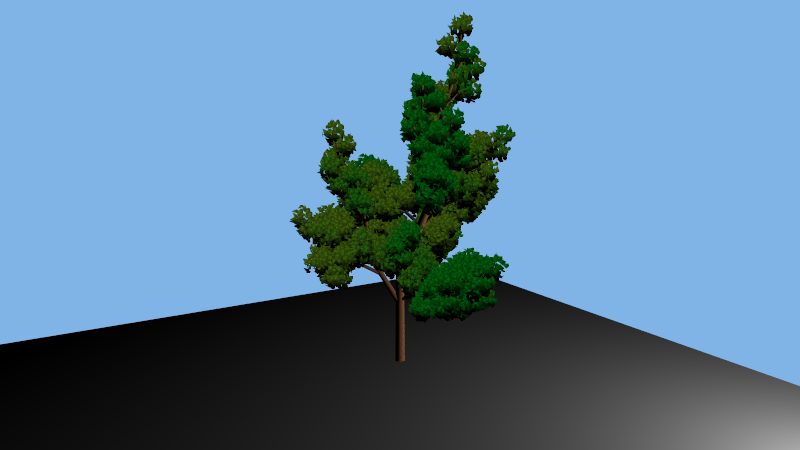
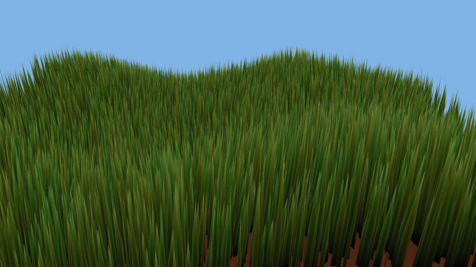
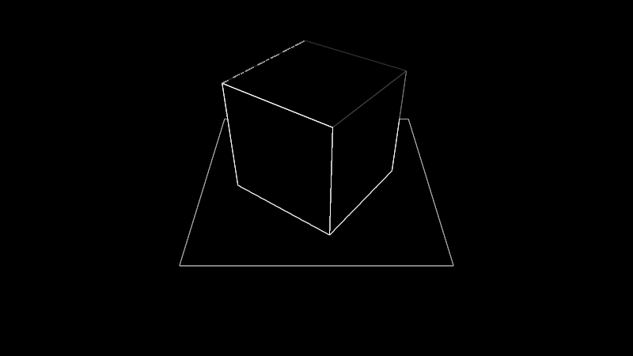
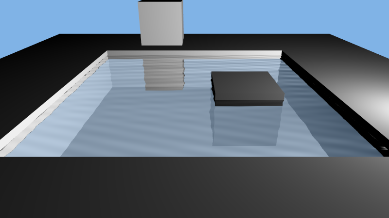

# WebGL examples

Collection of examples to lear WebGL and see what the differences with OpenGL are.\
All example should run on any modern web browser, on a desktop and a phone, by clicking on the title of each small description here

   

## [Triangle (hello world)](https://damdoy.github.io/webgl_examples/triangle/triangle.html)
Hello world type of project, to draw a single trianlge on screen

## [Rotating cube](https://damdoy.github.io/webgl_examples/cube_rotation/cube_rotation.html)
Use matrices to have a bit of movement on the screen

## [Shading](https://damdoy.github.io/webgl_examples/shading/shading.html)
Use light positions and shaders to have a simple phong shading

## [Texturing](https://damdoy.github.io/webgl_examples/texturing/texturing.html)
Feed a texture to the fragment shader and texture positons

## [Bumpmapping](https://damdoy.github.io/webgl_examples/bumpmapping/bumpmapping.html)
Use a special heightmap texture to give some relief to a flat plane

## [Framebuffer](https://damdoy.github.io/webgl_examples/framebuffer/framebuffer.html)
Draw the WebGL scene on a framebuffer, on which we can apply some effects/post processing

## [Water](https://damdoy.github.io/webgl_examples/water/water.html)
Simple water scene with some reflection and transparency of water

## [Grass](https://damdoy.github.io/webgl_examples/grass/grass.html)
Displays lots of grass blades moving independantly thanks to a wind map texture
Uses WebGL2 for the instanced rendering

## [Tree](https://damdoy.github.io/webgl_examples/tree/tree.html)
Tree generation using a L-System
Uses WebGL2 for the instanced rendering
